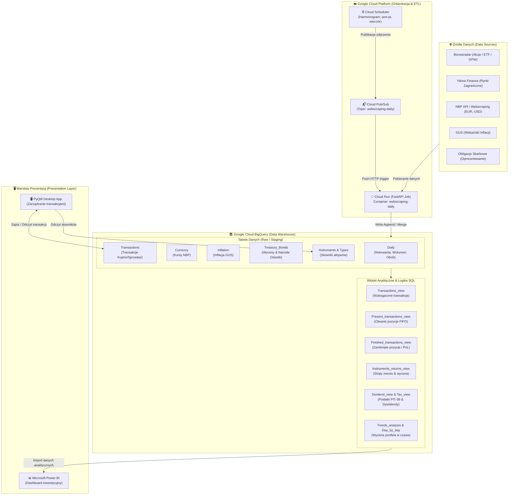

# 📈 Portfel Inwestycyjny – System Analizy, Automatyzacji ETL i Zarządzania Aktywami

[](https://www.python.org/)
[](https://cloud.google.com/)
[](https://cloud.google.com/bigquery)
[](https://www.docker.com/)
[](https://fastapi.tiangolo.com/)
[](https://www.riverbankcomputing.com/software/pyqt/)
[](https://powerbi.microsoft.com/)

---

## 📖 Spis Treści
1. [Wprowadzenie i Cel Projektu](#-wprowadzenie-i-cel-projektu)
2. [Kluczowe Możliwości Systemu](#-kluczowe-możliwości-systemu)
3. [Architektura Systemu i Przepływ Danych](#-architektura-systemu-i-przepływ-danych)
4. [Opis Modułów i Komponentów](#-opis-modułów-i-komponentów)
   - [1. Data Ingestion & Cloud ETL (GCP)](#1-data-ingestion--cloud-etl-gcp)V
   - [2. Silnik Wyceny Obligacji Skarbowych](#2-silnik-wyceny-obligacji-skarbowych)
   - [3. Hurtownia Danych i Model Analityczny (BigQuery)](#3-hurtownia-danych-i-model-analityczny-bigquery)
   - [4. Aplikacja Desktopowa (PyQt6)](#4-aplikacja-desktopowa-pyqt6)
   - [5. Raportowanie BI (Power BI)](#5-raportowanie-bi-power-bi)
5. [Struktura Repozytorium](#-struktura-repozytorium)
6. [Konfiguracja Środowiska i Zmienne](#-konfiguracja-środowiska-i-zmienne)
7. [Instrukcja Uruchomienia i Wdrożenia](#-instrukcja-uruchomienia-i-wdrożenia)
   - [Uruchomienie Lokalne (Aplikacja PyQt6)](#uruchomienie-lokalne-aplikacja-pyqt6)
   - [Budowanie i Wdrożenie w GCP Cloud Run](#budowanie-i-wdrożenie-w-gcp-cloud-run)
8. [Roadmapa i Plany Rozwoju](#-roadmapa-i-plany-rozwoju)
9. [Nota Prawna](#-nota-prawna)

---

## 🎯 Wprowadzenie i Cel Projektu

**Portfel Inwestycyjny** to kompleksowe, bezserwerowe środowisko do automatycznego śledzenia, wyceny oraz zaawansowanej analityki finansowej wieloaktywowego portfela inwestycyjnego. System łączy technologie chmurowe (**GCP**), inżynierię danych (**ETL / BigQuery SQL**), aplikację desktopową (**PyQt6**) oraz Business Intelligence (**Microsoft Power BI**).

Głównym celem projektu jest eliminacja konieczności ręcznego prowadzenia arkuszy kalkulacyjnych oraz dostarczenie wiarygodnych, zautomatyzowanych wskaźników do podejmowania decyzji inwestycyjnych w oparciu o:
* **Analizę Fundamentalną i Rynkową** (kursy akcji, ETF, wskaźniki makroekonomiczne, inflacja, dywidendy).
* **Automatyczne Rozliczanie Podatkowe (PIT-38)** – implementacja metody **FIFO** i przeliczanie kursów walut NBP z dnia roboczego poprzedzającego transakcję ($D-1$), zgodnie z polskim prawem podatkowym.
* **Precyzyjną Wycenę Obligacji Indeksowanych Inflacją** (uwzględniającą narosłe odsetki, marże i opóźnienie publikacji wskaźników GUS).

---

## ✨ Kluczowe Możliwości Systemu

* 🤖 **W pełni zautomatyzowany Cloud ETL**: Bezobsługowy, codzienny proces pobierania danych rynkowych uruchamiany przez **Cloud Scheduler**, kolejkowany w **Pub/Sub** i przetwarzany w kontenerze **Cloud Run (FastAPI + Docker)**.
* 🌐 **Wielorodne Źródła Danych**:
  * Giełda i fundusze: *BiznesRadar*, *Yahoo Finance (`yfinance`)*, *Google Finance*.
  * Waluty: Tabela kursów średnich **NBP** (EUR, USD).
  * Makroekonomia: Wskaźniki inflacji CPI (**GUS**).
  * Papiery dłużne: Tabele oprocentowań polskich obligacji skarbowych.
* 🏛️ **Hurtownia Danych BigQuery**:
  * Znormalizowane tabele faktów i wymiarów.
  * Zestaw zoptymalizowanych widoków SQL realizujących kalkulacje zysków zrealizowanych/niezrealizowanych, zwrotów dziennych, analizy trendów i podatków.
* 🖥️ **Aplikacja Desktopowa PyQt6**:
  * Graficzny interfejs do wprowadzania, edycji i usuwania transakcji (Kupno / Sprzedaż / Dywidenda / Odsetki).
  * Wielowątkowa komunikacja z BigQuery (`QThread`, pasek postępu, asynchroniczność), zapobiegająca blokowaniu GUI.
  * Walidacja poprawności danych transakcyjnych w czasie rzeczywistym.
* 📊 **Zaawansowany Dashboard Power BI**:
  * Prezentacja stóp zwrotu (TWR / MWR / ROI), alokacji sektorowej, geograficznej i walutowej.
  * Płynna analiza zysków historycznych i strumieni pasywnego dochodu (dywidendy).

---

## 🏗️ Architektura Systemu i Przepływ Danych



---

## 🧩 Opis Modułów i Komponentów

### 1. Data Ingestion & Cloud ETL (GCP)
* **Katalog**: `cloud_run/`, `webscraping/`, `yahoo_finance/`
* **Silnik**: Aplikacja oparta na **FastAPI** uruchamiana w kontenerze Docker na **GCP Cloud Run**.
* **Obsługa wiadomości**: Endpoint przyjmuje zaszyfrowany w base64 payload od **Cloud Pub/Sub**, uruchamiany cyklicznie przez **Cloud Scheduler** po zakończeniu sesji giełdowej.
* **Zakres scrapingu**:
  * Kursy zamknięcia, min/max, wolumen i wartość obrotu z polskich serwisów finansowych.
  * Tabela kursów średnich NBP (przeliczenia walut obcych na PLN).
  * Odczyt danych inflacyjnych pod kątem indeksacji obligacji.

### 2. Silnik Wyceny Obligacji Skarbowych
* **Algorytm**: Moduł realizuje automatyczne wyliczanie wartości obligacji skarbowych (np. 4-letnich COI, 10-letnich EDO itp.) na każdy dzień kalendarzowy:
  $$\text{Wartość} = \text{Wartość Nominalna} + \text{Narosłe Odsetki}$$
* Uwzględnia:
  * Cykle roczne (kapitalizacja odsetek lub wypłata roczna).
  * Marżę stałą emitenta + stopę inflacji GUS z uwzględnieniem 2-miesięcznego opóźnienia publikacji wskaźników (**inflation lag**).
  * Dzienny przyrost odsetek liczony proporcją dni w danym roku odsetkowym.

### 3. Hurtownia Danych i Model Analityczny (BigQuery)
* **Katalog**: `tables/`, `views/`, `scheduled_queries/`
* **Struktura tabel**:
  * `Daily` – dzienne notowania wszystkich śledzonych tickerów.
  * `Transactions` – baza wykonanych operacji (ID, Ticker, Typ, Wolumen, Cena, Prowizja, Waluta, Kurs NBP).
  * `Instruments` & `Instrument_types` – metadane instrumentów (kategoria, waluta, status aktywności).
  * `Treasury_Bonds`, `Currency`, `Inflation`, `Dates` – tabele referencyjne i wymiary.
* **Widoki analityczne (Views)**:
  * `Present_transactions_view.sql` – wyznaczanie aktualnie posiadanych jednostek metodą **FIFO** wraz ze średnią ceną ważoną.
  * `Finished_transactions_view.sql` – kojarzenie zleceń sprzedaży ze zrealizowanymi zakupami i wyliczanie historycznego zysku.
  * `Tax_view.sql` – estymacja podatku od zysków kapitałowych (podatek Belki 19%) z uwzględnieniem kosztów uzyskania przychodu (prowizje maklerskie) i kursów walut NBP.
  * `Dividend_view.sql` – ewidencja wpływów dywidendowych brutto/netto i podatków u źródła (WHT).
  * `Day_by_day_ticker_values.sql` – dzienna wartość rynkowa każdej otwartej pozycji.

### 4. Aplikacja Desktopowa (PyQt6)
* **Katalog**: `desktop_app/Portfel_inwestycyjny_DesktopApp.py`
* **Główne funkcje**:
  * Intuicyjny interfejs GUI do rejestrowania nowych transakcji giełdowych, obligacyjnych i walutowych.
  * Automatyczne uzupełnianie danych (pobieranie aktualnych kursów walut NBP, pobieranie listy dostępnych instrumentów z bazy).
  * **Asynchroniczność**: Operacje bazodanowe wykonywane w tle za pomocą `QThread` z dynamicznym dialogiem postępu (`ProgressDialog`), co gwarantuje pełną płynność interfejsu.
  * Walidacja danych wejściowych (kontrola formatów dat, typów numerycznych, sprawdzanie dostępności wolumenu przy sprzedaży).

### 5. Raportowanie BI (Power BI)
* **Plik poglądowy**: `Dashboard inwestycyjny - portfel pokazowy.pdf`
* **Zawartość raportu**:
  * **Portfolio Summary**: Całkowita wycena, kapitał wpłacony, zysk netto, bieżąca stopa zwrotu vs benchmark (np. WIG, S&P 500).
  * **Asset Allocation**: Struktura podziału na Akcje GPW, Akcje Zagraniczne, ETF, Obligacje Skarbowe, Gotówkę.
  * **Performance Per Instrument**: Zyski i straty w podziale na poszczególne spółki/aktywa.
  * **Income & Dividends**: Kalendarz dywidend, prognoza wypłat i stopa dywidendy (Dividend Yield).
  * **Tax Report**: Zestawienie pod roczne zeznanie podatkowe PIT-38.

---

## 📁 Struktura Repozytorium

```plaintext
Portfel_inwestycyjny/
├── cloud_pub_sub/              # Definicje tematów i subskrypcji GCP Pub/Sub
│   └── invest-project_ps_.../
│       └── DEPLOYMENT.md
├── cloud_run/                  # Konteneryzacja i kod mikroserwisów Cloud Run
│   └── invest_project_cservice_.../
│       ├── Dockerfile          # Kontener bazowy dla procesu ETL
│       ├── job.yaml            # Specyfikacja usługi Cloud Run
│       ├── main.py             # Aplikacja FastAPI (odbiornik Pub/Sub & executor)
│       └── requirements.txt
├── cloud_scheduler/            # Konfiguracja harmonogramu zadań (cron GCP)
│   └── invest-project_csched_.../
│       └── DEPLOYMENT.md
├── desktop_app/                # Aplikacja okienkowa do obsługi portfela
│   └── Portfel_inwestycyjny_DesktopApp.py  # Aplikacja PyQt6
├── scheduled_queries/          # Zapytania cykliczne BigQuery (aktualizacja statusów)
│   └── Instruments_status_update.sql
├── tables/                     # Schematy DDL tabel w Google Cloud BigQuery
│   ├── daily.sql               # Tabela dziennych notowań
│   ├── dates.sql               # Wymiar dat
│   ├── instruments.sql         # Słownik instrumentów
│   ├── instrument_types.sql    # Typy instrumentów
│   ├── tax_calculations.sql    # Schemat tabeli wyliczeń podatkowych
│   ├── transactions.sql        # Tabela transakcji kupna/sprzedaży
│   └── treasury_bonds.sql      # Tabela wycen obligacji
├── utils/                      # Skrypty narzędziowe, migracje DDL, powiadomienia e-mail
│   ├── Create_tables_and_views_in_python.py
│   ├── send_email/             # Moduł wysyłki powiadomień Gmail API
│   └── ...
├── views/                      # Widoki analityczne SQL w BigQuery
│   ├── Currency_view.sql
│   ├── Day_by_day_ticker_values.sql
│   ├── Dividend_view.sql
│   ├── Finished_transactions_view.sql
│   ├── Instruments_returns_view.sql
│   ├── Present_transactions_view.sql
│   ├── Tax_view.sql
│   ├── Transactions_view.sql
│   └── Trends_analysis.sql
├── webscraping/                # Moduły scrapujące dane (BiznesRadar, GUS, NBP)
│   ├── biznesradar_webscraping/
│   ├── currencies_webscraping.py
│   ├── google_finance_webscraping.py
│   └── inflation_webscraping.py
├── yahoo_finance/              # Moduł integracji z biblioteką yfinance
│   ├── bigquery_handler.py
│   ├── data_transform.py
│   ├── main.py
│   └── yfinance_provider.py
├── Dashboard inwestycyjny - portfel pokazowy.pdf # Poglądowy raport Power BI
├── requirements.txt            # Globalne zależności Python
└── README.md                   # Dokumentacja projektu
```

---

## ⚙️ Konfiguracja Środowiska i Zmienne

### 1. Wymagania Wstępne
* Python w wersji **3.11** lub nowszej
* Konto w **Google Cloud Platform** z aktywnym projektem oraz włączonymi API:
  * BigQuery API
  * Cloud Run Admin API
  * Cloud Pub/Sub API
  * Cloud Scheduler API
  * Artifact Registry API
* Zainstalowane narzędzie `gcloud CLI` oraz `Docker`

### 2. Plik Konfiguracyjny `.env`
Utwórz plik `.env` w katalogu głównym projektu (w oparciu o poniższy wzorzec):

```env
# Google Cloud Platform
GCP_PROJECT_ID=twoj-projekt-inwestycyjny
GCP_REGION=europe-central2
GOOGLE_APPLICATION_CREDENTIALS=sciezka/do/twojego_klucza_serwisowego.json

# BigQuery Datasets
BQ_DATASET_NAME=Invest_project
BQ_DAILY_TABLE=Daily
BQ_TRANSACTIONS_TABLE=Transactions
BQ_INSTRUMENTS_TABLE=Instruments
BQ_BONDS_TABLE=Treasury_Bonds
```

---

## 🚀 Instrukcja Uruchomienia i Wdrożenia

### Uruchomienie Lokalne (Aplikacja PyQt6)

1. **Sklonuj repozytorium i utwórz wirtualne środowisko**:
   ```bash
   git clone https://github.com/twoj-login/Portfel_inwestycyjny.git
   cd Portfel_inwestycyjny
   python -m venv .venv
   ```

2. **Aktywuj środowisko wirtualne**:
   * Windows:
     ```powershell
     .\.venv\Scripts\Activate.ps1
     ```
   * Linux / macOS:
     ```bash
     source .venv/bin/activate
     ```

3. **Zainstaluj zależności**:
   ```bash
   pip install -r requirements.txt
   ```

4. **Uruchom aplikację desktopową**:
   ```bash
   python desktop_app/Portfel_inwestycyjny_DesktopApp.py
   ```

---

### Budowanie i Wdrożenie w GCP Cloud Run

Wdrożenie pipeline'u ETL opiera się na kontenerach Docker rejestrowanych w **Artifact Registry** i uruchamianych w **Cloud Run**:

1. **Uwierzytelnij się w Google Cloud**:
   ```bash
   gcloud auth login
   gcloud auth configure-docker europe-central2-docker.pkg.dev
   ```

2. **Zbuduj obraz Docker**:
   ```bash
   cd cloud_run/invest_project_cservice_eu-central2_webscraping_daily
   docker build -t europe-central2-docker.pkg.dev/projekt-inwestycyjny/cloud-run-source-deploy/invest-project-cservice-eu-central2-webscraping-daily:latest .
   ```

3. **Wypchnij obraz do Artifact Registry**:
   ```bash
   docker push europe-central2-docker.pkg.dev/projekt-inwestycyjny/cloud-run-source-deploy/invest-project-cservice-eu-central2-webscraping-daily:latest
   ```

4. **Wdróż usługę w Cloud Run**:
   ```bash
   gcloud run services replace job.yaml --region=europe-central2
   ```

5. **Skonfiguruj subskrypcję Pub/Sub i Scheduler**:
   * Utwórz zadanie w **Cloud Scheduler** wyzwalające temat Pub/Sub `webscraping-daily` od poniedziałku do piątku o godzinie 18:00 CET.
   * Ustaw subskrypcję typu Push kierującą na endpoint usługi w Cloud Run.

---

## 🗺️ Roadmapa i Plany Rozwoju

- [x] Automatyzacja pobierania danych giełdowych, walutowych i wskaźników makro (GCP ETL).
- [x] Model hurtowni BigQuery z pełną obsługą FIFO i podatku giełdowego PIT-38.
- [x] Aplikacja desktopowa PyQt6 do zarządzania portfelem i transakcjami.
- [x] Dashboard analityczny w Microsoft Power BI.
- [ ] **Migracja do aplikacji webowej** (FastAPI / Next.js lub Streamlit) z dostępem wieloużytkownikowym.
- [ ] **Moduł Alerty & Powiadomienia**: Automatyczne powiadomienia e-mail / Telegram o ważnych sygnałach technicznych, wybiciach poziomów cenowych i publikacjach raportów finansowych.
- [ ] **Zaawansowane Modele Machine Learning**: Predykcja zmienności, estymacja wskaźników Sharpe'a i optymalizacja portfela Markowitza.

---

## 📄 Nota Prawna

> **Zastrzeżenie**: Przedstawiony projekt i zawarte w nim algorytmy służą wyłącznie celom edukacyjno-analitycznym oraz zarządzaniu prywatnym portfelem. Treści generowane przez system nie stanowią rekomendacji inwestycyjnych w rozumieniu przepisów Rozporządzenia Ministra Finansów z dnia 19 października 2005 r. w sprawie informacji stanowiących rekomendacje dotyczące instrumentów finansowych lub ich emitentów.
